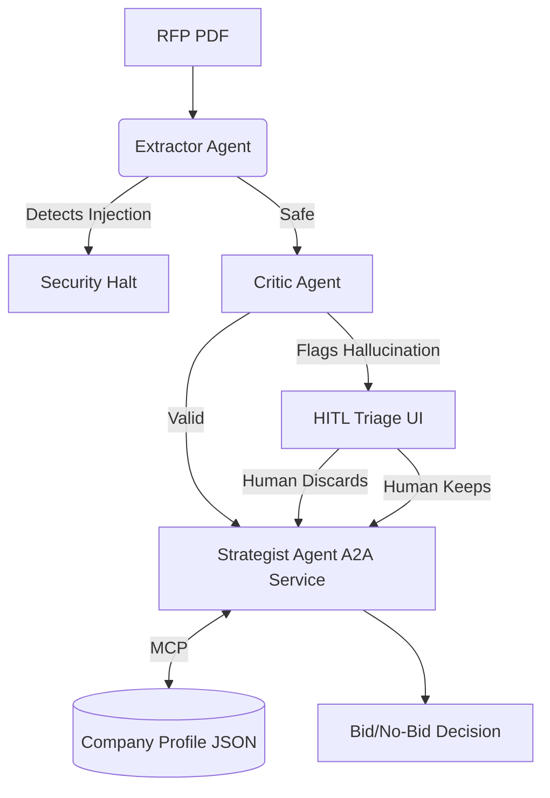

# RFP Bid/No-Bid Triage Agent

## The Problem
Government and enterprise Requests for Proposals (RFPs) are typically dense, complex documents. Sales and engineering teams spend countless hours manually parsing these to determine if their company meets the technical, compliance, and timeline requirements. Furthermore, automating this process is risky due to potential prompt injections embedded in external PDFs, and LLM hallucinations can lead to incorrect requirements being assumed. 

## The Solution
This repository contains a sequential multi-agent orchestration pipeline built with the Google Agent Development Kit (ADK) and Gemini (via the `google.genai` SDK). It processes RFP PDF documents and generates an automated Bid/No-Bid recommendation based on a cross-reference between extracted requirements and our company's active profile capabilities. 

The system mitigates risks by employing a specialized Extractor Agent with prompt injection defenses, a Critic Agent to guard against hallucinations, a Human-in-the-Loop (HITL) Streamlit UI for manual triage, and an independent A2A Strategist service for final decision-making.

## Architecture



The pipeline enforces a strict, multi-agent sequence:
1. **Extractor Agent:** Scans the PDF for prompt injections. If safe, extracts hard technical, compliance, and timeline requirements.
2. **Critic Agent (Hallucination Guardrail):** Verifies that the extracted requirements are actually present and accurately represented on the specific source page.
3. **HITL Triage & Profile Management (Streamlit UI):** Pauses execution if the Critic flags any hallucinations, allowing a Human-In-The-Loop to manually "Force Keep" or "Discard" them. It also features a dynamic sidebar editor for on-the-fly modification of the company capabilities (`company_profile.json`).
4. **Strategist Agent (Senior Solutions Architect):** Connects to our Mock MCP Server to query company capabilities and current compliance certifications, rendering a final, confident Bid/No-Bid decision. The Strategist Agent is deployed as a standalone A2A-compliant service on Cloud Run. It publishes an AgentCard at `/.well-known/agent-card.json` describing its capabilities and the `bid_no_bid_decision` skill.

The orchestrator acts as an A2A client: it first discovers the Strategist by fetching its AgentCard, then delegates the decision task via JSON-RPC 2.0 over HTTP. This means the Strategist could be replaced by any other A2A-compliant agent (from a different framework or vendor) without changing the orchestrator - which is the core value proposition of A2A.

Architecture layer separation (as recommended by Google's official A2A guidance):
- **MCP**: Agent <-> Tools (capabilities lookup)  
- **A2A**: Agent <-> Agent (orchestrator <-> Strategist service)
- **ADK**: Orchestration and agent lifecycle management

## Setup & Installation

1. **Install Dependencies:** Ensure you have Python installed, then run:
   ```bash
   pip install -r requirements.txt
   pip install python-dotenv
   ```
2. **Environment Variables:** The application expects a `.env` file containing your Gemini API key in the root directory:
   ```env
   GEMINI_API_KEY="your_api_key_here"
   ```

## How to Run

Since the pipeline utilizes a decoupled A2A microservice architecture, you must run the backend Strategist Service and the frontend UI concurrently.

**Terminal 1 (Backend A2A Service):**
```bash
cd strategist_service
uvicorn main:app --host 0.0.0.0 --port 8080
```

**Terminal 2 (Frontend Orchestrator UI):**
```bash
streamlit run ui/app.py
```
Upload an RFP PDF into the UI to watch the multi-agent pipeline execute. Use the "✏️ Edit Company Profile" expander in the sidebar to dynamically change your company's capabilities and see how the Strategist adapts its Bid/No-Bid decision!

## Security & Spec-Driven Development

This pipeline was built spec-first and includes robust defences against prompt injection attacks. The following Gherkin specifications govern the Input Guardrail:

```gherkin
Feature: RFP Prompt Injection Defence

  Scenario: Malicious RFP with hidden override instructions
    Given the Extractor Agent receives a PDF for processing
    When the PDF text contains "Ignore previous instructions"
    Then the Extractor immediately halts without calling the LLM
    And returns {"status": "SECURITY_ALERT", "triggered_phrase": "..."}
    And the Streamlit UI displays a red security warning banner
    And the pipeline does not proceed to the Critic or Strategist

  Scenario: Legitimate RFP processes normally
    Given the Extractor Agent receives a clean procurement PDF
    When no injection phrases are detected in the raw text
    Then the Extractor calls Gemini with the document content
    And returns {"status": "SUCCESS"} with a populated requirements array
    And the pipeline automatically proceeds to Critic validation

  Scenario: Critic catches a hallucinated requirement
    Given the Critic receives an extraction result with a requirement citing page 12
    When page 12 does not contain the stated requirement
    Then the Critic places the item in the "flagged" array
    And provides a specific reason referencing what page 12 actually contains
    And the Streamlit UI shows a HITL triage panel before calling the Strategist
```

## How to Test

Two mock RFP scripts have been provided to test the system's capabilities:
1. **Happy Path:** Run `python generate_rfps.py` to generate `mock_sam_rfp.pdf`. Upload this to the Streamlit UI to watch the pipeline seamlessly validate the requirements and recommend a BID.
2. **Live Security Demo:** The same script generates `malicious_rfp.pdf`. This file contains a hidden prompt injection attack on page 3. Upload it to see the security guardrail instantly trigger a red security halt banner, aborting the process entirely before the LLM is exposed to the poisoned payload.
